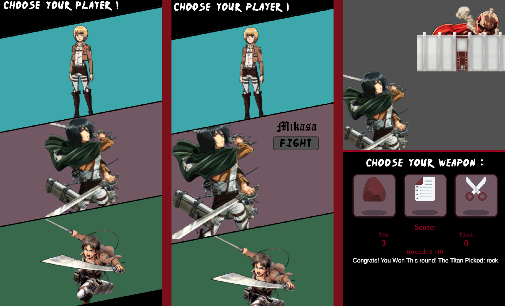

# Mobile Rock-Paper-Scissors Game

## Inspired By: Attack On Titan

### Front-End Learning Project

This project is an assignment from [The Odin Project](https://www.theodinproject.com/)

### Note: 
- This project is mobile only to get a sense of mobile first development.
- The whole project has a media query to not display if the screen is <= 500px wide.
- When viewing the active deployment enable Developer Tools and select a mobile responsive viewport to see the project.
- This project is for personal use only.

### Screens:

#### Credit:
- [CSS Reset File](https://meyerweb.com/eric/tools/css/reset/)
- [Wall Graphic](https://www.deviantart.com/acerbuskeeper/art/SNK-wall-divider-w-gate-405862073) User: AcerbusKeeper
- [Rock Paper Scissors Icons (Before Re-Color)](https://www.vecteezy.com/free-vector/rock)

